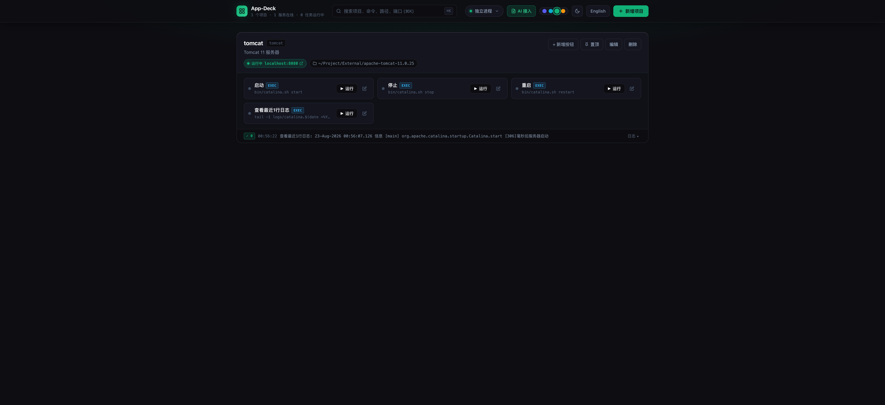
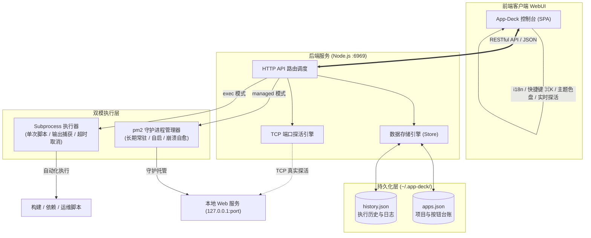

# App-Deck

跨平台「项目台账 + 脚本按钮控制台」。一个网页管理你所有的 Web 应用与运维脚本：项目置顶、分组管理、双模执行、TCP 端口探活、pm2 守护以及 AI 自动接入。

---

## 界面预览



---

## 为什么选择 App-Deck

当本地 Web 应用与开发脚本越来越多时，启动、停止、查日志都要进各个目录敲命令，还要反复记忆端口与命令参数。App-Deck 将本地所有项目运维收敛为一个极简、高质感的现代化控制台：

- **一屏尽览**：打开 `http://localhost:6969` 即见所有项目、端口状态与快捷按钮。
- **双模执行**：
  - **托管按钮 (pm2)**：交由 pm2 守护，支持崩溃自动拉起与后台常驻。
  - **执行按钮 (exec)**：直接执行一次性脚本，秒级捕获输出、退出码与历史日志。
- **服务探活**：真实 TCP 连接实时探活，端口通畅即亮起翡翠绿呼吸灯，在线/离线一目了然。
- **支持网页实时修改按钮的脚本**：在网页端随时点击编辑修改按钮的执行脚本（例如将 `tail -1 logs/catalina.log` 秒级调整为 `tail -10 logs/catalina.log`），保存即时持久化生效，无需重启服务或改配置文件。
- **项目置顶**：常用项目一键置顶（Pinned），多项目置顶按时间智能排序。
- **AI 自动化接入**：完备的 RESTful API，AI 助手可直接阅读文档后通过 curl 自动注册和维护项目。

---

## 核心特性

| 特性 | 说明 |
|---|---|
| **项目台账** | 项目分组与按钮卡片，一屏流直观布局，无繁琐层级 |
| **项目置顶** | 卡片一键置顶/取消置顶，最新置顶自动排在最前 |
| **修改按钮脚本** | 支持网页实时修改按钮的脚本与参数（如临时调整 `tail` 行数），保存即时生效 |
| **端口探活** | 配置端口后增量并发 TCP 探活，一体化状态胶囊秒级感知 |
| **双模按钮** | 托管（pm2 守护/自启/崩溃自愈）与执行（单次脚本/输出捕获/取消）|
| **即时日志** | 卡片内置折叠式执行历史与日志抽屉，支持按需展开完整输出 |
| **全局检索** | 支持快捷键 `⌘K` / `Ctrl+K` 模糊搜索项目名、ID、路径、端口与命令 |
| **深浅色与色盘** | 默认 Obsidian 深色空间，支持深浅外观切换及 4 套精调主题强调色 |
| **跨平台支持** | 完整支持 macOS、Linux 与 Windows |
| **开机自启** | macOS 用户级 launchd 一键开关（无密码免弹窗）|
| **AI 自动对接** | 幂等 HTTP API，顶部内置「AI 接入」按钮一键复制对接提示词 |
| **多语言** | 完整 i18n 支持（默认中文，支持一键切换英文）|

---

## 技术架构



- **后端**：Node.js（>= 18），RESTful HTTP API 为第一等公民，UI 仅作为 API 的轻量客户端。
- **数据持久化**：`~/.app-deck/apps.json`（项目配置）与 `~/.app-deck/history.json`（执行历史）。
- **默认端口**：固定 `6969`。

---

## 快速开始

### 1. 准备环境

- Node.js >= 18（https://nodejs.org）
- 安装 pm2 进程管理（全局一次性安装）：
  ```bash
  npm install pm2 -g
  ```

### 2. 启动服务

```bash
cd app-deck
npm start
```

浏览器打开 `http://localhost:6969` 即可开始使用。

---

## 生产运行与后台守护

### 日常推荐运行（pm2 常驻守护）

```bash
cd app-deck
pm2 start src/index.js --name app-deck   # 启动并由 pm2 守护
pm2 save                                  # 固化进程配置
```

服务启动后，在 App-Deck 界面右上角「系统引擎」菜单中即可直接可视化开关「守护进程」与「开机自启」，无需手动敲命令。

### 常用管理命令

```bash
pm2 status app-deck            # 查看服务运行状态
pm2 logs app-deck              # 查看控制台日志
pm2 restart app-deck           # 重启服务
pm2 stop app-deck              # 停止服务
```

---

## 目录结构

```
app-deck/
├── src/            # 后端核心源码
│   ├── index.js    # HTTP API 服务入口与路由
│   ├── store.js    # JSON 数据持久化引擎
│   ├── executor.js # 跨平台 Subprocess 执行器
│   └── pm2.js      # pm2 CLI 守护进程集成封装
├── public/         # 前端单页应用 (SPA)
│   ├── index.html  # 页面骨架
│   ├── style.css   # 现代化 Obsidian 深浅主题样式
│   ├── app.js      # 客户端交互、探活与轮询逻辑
│   └── i18n.js     # 中英双语国际化字典
├── test/           # 自动化测试用例 (node:test)
├── docs/           # 项目文档与资源
│   ├── images/     # UI 界面预览截图
│   └── AIUsage.md  # AI 接入规范与 API 完整参考
└── package.json
```

---

## 自动化测试

项目内置完整的端到端与单元测试套件：

```bash
npm test            # 运行全部 43 项测试用例 (node --test)
```

---

## 文档与 AI 接入

- [AI 接入指南与 API 规范文档](docs/AIUsage.md)
- 点击控制台右上角 **「AI 接入」** 按钮，可直接复制适配给大语言模型的专用 Prompt，助您通过 AI 助手自动化管理所有项目。

---

## License

MIT
