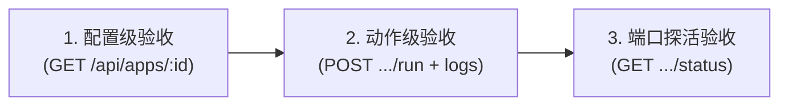

# AI 接入指南与 API 文档

> **文档版本 (Document Version)**: `v2.5.0` (2026-08-24)
> 
> **设计初衷与核心价值：**
> 
> App-Deck 是项目运维与快捷脚本的**唯一定义中心**，人类与 AI 共同使用这一套资产：
> 1. **用户通过 Web 界面统一查看**：用户可以直接在 Web 控制台查看各个项目的快捷功能与运行状态，并享受 JSON 语法树、Markdown 与 Mermaid 架构图的自动渲染；
> 2. **AI 代为执行与跨 Agent 运维**：
>    - 用户可以让 AI 代为执行某个按钮；
>    - **跨 Agent 一键接管**：跨不同 Agent（如 Claude、Cursor、Codex 等）时，只需一键复制界面顶部的 AI 接入文档发给新 Agent，即可通过 API 立即接管运维工作；
>    - **统一管理，避免脚本散落**：彻底避免不同 Agent 把临时脚本随地乱放、难以维护的混乱局面。

---

## 目录

- [模块一：核心概念与安全铁律](#模块一核心概念与安全铁律)
  - [1.1 双轨执行模式 (managed vs exec)](#11-双轨执行模式-managed-vs-exec)
  - [1.2 pm2 托管三大铁律](#12-pm2-托管三大铁律)
  - [1.3 破坏性高危操作四级安全防御矩阵](#13-破坏性高危操作四级安全防御矩阵)
  - [1.4 命令静态性与零交互铁律](#14-命令静态性与零交互铁律)
- [模块二：Agent 标准作业流程 (Agent SOP)](#模块二agent-标准作业流程-agent-sop)
  - [2.1 阶段一：分析与计划先行 (输出人机确认表)](#21-阶段一分析与计划先行-输出人机确认表)
  - [2.2 阶段二：人机确认后幂等写入 (PUT)](#22-阶段二人机确认后幂等写入-put)
  - [2.3 阶段三：三维闭环测试验收](#23-阶段三三维闭环测试验收)
  - [2.4 跨 Agent 一键接管 4 步流](#24-跨-agent-一键接管-4-步流)
- [模块三：数据模型与多模态规范](#模块三数据模型与多模态规范)
  - [3.1 App 与 Button 数据结构 Schema](#31-app-与-button-数据结构-schema)
  - [3.2 按钮多模态渲染矩阵 (outputFormat)](#32-按钮多模态渲染矩阵-outputformat)
  - [3.3 按钮命令支持的 4 种脚本形态](#33-按钮命令支持的-4-种脚本形态)
- [模块四：API 接口参考与场景示例](#模块四api-接口参考与场景示例)
  - [4.1 基础信息与通用约定](#41-基础信息与通用约定)
  - [4.2 常用场景 cURL 示例](#42-常用场景-curl-示例)
  - [4.3 完整 RESTful 接口字典](#43-完整-restful-接口字典)

---

## 模块一：核心概念与安全铁律

### 1.1 双轨执行模式 (managed vs exec)

App-Deck 采用双轨底层执行引擎，AI 在定义按钮时必须精准选择 `type`：

| 执行类型 (type) | 核心机制 | 适用场景 | UI 行为与按钮设计 |
|---|---|---|---|
| **`managed`** | pm2 守护进程管理（崩溃自动重启、系统开机自启、常驻后台） | 常驻 Web 服务、API 后端、Dev Server（如 Next.js、FastAPI、Flask、Vite） | **单一双态按钮**：点击 `▶ 启动` 开始，运行中自动变为 `⏹ 停止` |
| **`exec`** | 自研跨平台子进程执行器（单次执行、流式输出、退出后释放、支持超时与取消） | 一次性脚本：依赖安装、编译构建、数据备份、探活探测、架构图渲染 | **单次触发按钮**：点击触发，执行完毕恢复初始状态 |

---

### 1.2 pm2 托管三大铁律

> ⚠️ **所有 AI 必须严格遵守以下三大铁律，违反将导致进程脱壳或状态假死：**
> 
> 1. **单一入口，严禁冗余按钮**：`managed` 按钮在 Web 界面中已内置状态机与停止逻辑。**严禁为 `managed` 服务额外创建「关闭服务」、「停止服务」或「重启服务」按钮**；
> 2. **前台阻塞，严禁 `&` 与 `nohup`**：命令必须是**前台运行**（如 `python app.py`、`npm run dev`）。**严禁在命令末尾添加 `&`、`nohup` 或 `> /tmp/... 2>&1 &`**。若加了 `&`，pm2 主进程会立即退出并误判为 `stopped`，导致状态失控；
> 3. **传统非阻塞脚本才使用独立多按钮**：只有类似 Tomcat（`bin/catalina.sh start` / `stop`）这种自身是非阻塞的脚本工具，才全部使用 `exec` 类型并拆分按钮。

---

### 1.3 破坏性高危操作四级安全防御矩阵

| 风险类别 | 典型命令 | 潜在破坏后果 | AI 安全防御与验收策略 |
|---|---|---|---|
| **1. 数据与状态销毁** | `drop database`、`prisma migrate reset`、`rm -rf data/*`、`flushall` | 本地或数据库数据不可逆丢失 | **绝对严禁自动试跑**。仅做 `test -d` 路径存在性检查或 `--dry-run` 演练。 |
| **2. 生产与对外发布** | `npm publish`、`git push --force`、生产环境部署脚本 | 影响线上生产环境 | **绝对严禁自动试跑**。仅做语法预检。 |
| **3. 设备关机与硬杀** | `shutdown /s`、`reboot`、`kill -9` | 设备失联、无差别中断 | **绝对严禁自动试跑**。仅做 SSH 免密连通性检查。 |
| **4. 资金扣费与高消耗** | 批量调用高计费 API、无上限并发爬虫 | 产生资金或额度严重浪费 | **绝对严禁自动试跑**。仅做单次轻量探活。 |

> 🛡️ **破坏性按钮 4 级防御执行铁律**：
> 1. **计划表显式标红**：在向用户展示计划表时，必须打上 `⚠️ [高危/破坏性]` 明确警示；
> 2. **零副作用静态预检**：只允许使用 `bash -n script.sh`（语法校验）或 `python -m py_compile`，绝不触发实际执行；
> 3. **自动化验收绝对熔断**：AI 在执行动作级试跑时，**必须主动跳过所有高危/破坏性按钮**；
> 4. **执行权完全移交人类**：在最终交付报告中明确告知人类：“已完成静态预检，因该操作具有破坏性，未进行自动试跑，留待您在 Web 界面手动点击。”

---

### 1.4 命令静态性与零交互铁律

1. **固定命令字符串**：App-Deck 按钮命令是点击即刻执行的固定字符串，**不支持运行时 UI 弹窗输入参数**；
2. **严禁动态占位符**：**严禁在命令中写入 `$1`、`$2`、`<parameter>`、`[branch_name]` 等未绑定的占位符**；
3. **零交互式提示 (Non-Interactive)**：命令执行过程中不能要求终端交互输入（如 `read -p`、交互式 `sudo` 密码输入、`npm init` 问答等），需配置 `-y`、`--non-interactive` 或以免密方式执行。

---

## 模块二：Agent 标准作业流程 (Agent SOP)

### 2.1 阶段一：分析与计划先行 (输出人机确认表)

**禁止未经人类确认直接调用 API 静默写入！**
AI 必须先整理一份清晰直白的 Markdown 计划表呈现给用户，清晰说明要登记什么项目、注入哪些按钮。

#### 标准计划表示例

##### 拟登记项目：个人博客 (blog)
- **项目基本信息**：目录 `/path/to/blog` | 服务端口 `3000` | 访问地址 `http://localhost:3000` | 备注 `Next.js 博客系统`
- **拟注入按钮清单**：

| 按钮名称 | 按钮标识 | 执行类型 | 输出格式 (text/json/markdown) | 执行命令 | 用途说明 |
|---|---|---|---|---|---|
| 启动服务 | `start` | 常驻守护 | text | `npm run dev` | 拉起开发服务，支持崩溃自愈 |
| 运行测试 | `test` | 单次执行 | text | `npm test` | 执行全套自动化测试 |
| 接口探活 | `health` | 单次执行 | json | `curl -s http://localhost:3000/api/health` | 自动以可折叠 JSON 树展示 |
| 架构拓扑 | `arch` | 单次执行 | markdown | `cat docs/architecture.md` | 自动渲染 Markdown 与 Mermaid 图 |
| ⚠️ 清空缓存 | `clean` | 单次执行 | text | `rm -rf .next/cache` | ⚠️ [破坏性] 清除本地构建缓存 |

---

### 2.2 阶段二：人机确认后幂等写入 (PUT)

用户明确同意后，AI 发起 `PUT /api/apps/:appId`（全量覆盖）或 `PUT .../buttons/:buttonId`（单按钮追加）完成写入。

---

### 2.3 阶段三：三维闭环测试验收

AI 注册完成后，必须严格按照顺序执行三维闭环验收：



1. **第 1 维：静态配置一致性验收**
   - 调用 `GET /api/apps/:appId`，确认返回的 buttons 清单、工作目录 `dir`、端口 `port` 与预期的 Markdown 计划表 100% 一致。
2. **第 2 维：安全动作真实验收（试跑与断言）**
   - 针对非破坏性按钮（如 `test`、`health` 探活）发起 `POST /api/apps/:appId/buttons/:buttonId/run`；
   - 紧接着拉取 `GET /api/apps/:appId/buttons/:buttonId/logs`，断言 `exitCode === 0` 且 `success === true`。
3. **第 3 维：服务端口探活验收**
   - 针对 Web 常驻服务，发起启动后调用 `GET /api/apps/:appId/status`；
   - 断言返回 `{ "online": true }`，确保 TCP 端口已被真正监听，卡片翡翠绿呼吸灯正常亮起。
4. **高危按钮安全隔离**：
   - 跳过标记为 `⚠️ [破坏性]` 按钮的自动试跑，仅进行 `bash -n` 静态预检，在报告中向人类说明。

---

### 2.4 跨 Agent 一键接管 4 步流

当任何新的 AI Agent 介入项目时，遵循以下 4 步即可无缝接管运维：

1. **探测发现 (Discovery)**：读取所有已登记项目与按钮
   ```bash
   curl http://localhost:6969/api/apps
   ```
2. **代为执行 (Execute)**：触发指定项目的某个运维动作
   ```bash
   curl -X POST http://localhost:6969/api/apps/tomcat/buttons/start/run
   ```
3. **检查产物 (Inspect)**：获取最新执行状态与多模态日志
   ```bash
   curl http://localhost:6969/api/apps/tomcat/buttons/start/logs
   ```
4. **集中增补 (Upsert)**：发现缺少命令时，通过 API 自动增补新按钮（集中管理，不污染本地目录）
   ```bash
   curl -X PUT http://localhost:6969/api/apps/tomcat/buttons/clean-cache      -H 'Content-Type: application/json'      -d '{"label": "清理缓存", "type": "exec", "outputFormat": "text", "command": "rm -rf work/* temp/*"}'
   ```

---

## 模块三：数据模型与多模态规范

### 3.1 App 与 Button 数据结构 Schema

#### App（项目）
```json
{
  "id": "blog",
  "name": "博客系统",
  "description": "个人博客 web 应用",
  "dir": "/path/to/blog",
  "url": "http://localhost:3000",
  "port": 3000,
  "pinned": false,
  "buttons": []
}
```

| 字段 | 类型 | 必填 | 说明 |
|---|---|---|---|
| `id` | string | ✅ | 唯一标识，URL 安全字符（`a-z0-9-`），创建后不可变 |
| `name` | string | ✅ | 展示名称 |
| `description` | string | ❌ | 备注 |
| `dir` | string | ❌ | 项目目录（按钮命令的相对基准目录） |
| `url` | string | ❌ | 项目访问地址（用于「打开链接」类按钮） |
| `port` | number | ❌ | 服务端口（用于毫秒级 TCP 运行状态探活） |
| `pinned` | boolean | ❌ | 是否置顶（置顶项目优先排在前面） |
| `buttons` | Button[] | ✅ | 按钮列表 |

#### Button（按钮）
```json
{
  "id": "start",
  "label": "启动服务",
  "type": "managed",
  "command": "npm run dev",
  "cwd": null,
  "shell": true,
  "outputFormat": "text"
}
```

| 字段 | 类型 | 必填 | 说明 |
|---|---|---|---|
| `id` | string | ✅ | 按钮唯一标识（app 内唯一），创建后不可变 |
| `label` | string | ✅ | 显示名称 |
| `type` | string | ✅ | `managed` = pm2 托管；`exec` = 一次性执行 |
| `command` | string | ❌ | 执行的 shell 命令（无动态传参的固定字符串） |
| `cwd` | string | ❌ | 工作目录，缺省继承 `app.dir` |
| `shell` | boolean | ❌ | 是否经 shell 执行（默认 `true`） |
| `outputFormat` | string | ❌ | 输出渲染格式：`text`、`json`、`markdown` |

---

### 3.2 按钮多模态渲染矩阵 (outputFormat)

App-Deck 控制台内置了多模态渲染引擎，根据按钮的 `outputFormat` 自动激活专属呈现视图：

| outputFormat | 展现与渲染机制 | 推荐应用场景 | 示例命令 |
|---|---|---|---|
| **`text`** (默认) | 标准 stdout 文本输出。支持 ANSI 彩色控制符与 `INFO`（蓝）、`WARN`（黄）、`ERROR`（红）日志级别高亮 | 普通文本、构建日志、服务输出、系统探测 | `echo -e "\033[32m[INFO]\033[0m 服务启动成功"` |
| **`json`** | 自动解析 JSON 并呈现为可交互折叠的语法树，高亮键值与类型（解析异常时平滑降级展示文本） | 接口健康探活、配置读取、统计数据提取 | `curl -s http://localhost:6969/api/health` |
| **`markdown`** | 完整支持 Markdown 语法（标题、表格、加粗、列表）以及嵌入的 ````mermaid` 高清矢量 SVG 流程图/时序图渲染 | 系统分析报告、指标矩阵、环境快照、架构拓扑 | 包含 ````mermaid\nflowchart LR\n  A --> B\n```` |

---

### 3.3 按钮命令支持的 4 种脚本形态

1. **直接调用独立脚本文件**：
   `python3 scripts/backup.py` 或 `./deploy.sh`
2. **多命令串联与管道控制 (复合脚本)**：
   - 顺序执行（`&&`）：`git pull && npm install && npm run build`
   - 条件分支（`||`）：`test -d .venv || python3 -m venv .venv`
   - 管道过滤（`|`）：`ps aux | grep node | grep -v grep`
3. **内联 Python 脚本 (`-c`)**：
   `python3 -c "import time; print('准备备份...'); time.sleep(1); print('完成')"`
4. **内联 Bash 脚本 (`-c`)**：
   `bash -c 'for i in 1 2 3 4 5; do echo "进度: $i"; sleep 1; done'`

---

## 模块四：API 接口参考与场景示例

### 4.1 基础信息与通用约定

| 配置项 | 约定值 |
|---|---|
| 服务地址 | `http://localhost:6969` |
| 数据文件 | `~/.app-deck/apps.json`（本地持久化） |
| 响应格式 | 全部以 JSON 返回，`Content-Type: application/json` |
| 幂等语义 | 所有 `PUT` 写入均为覆盖语义，重复调用不报错、不产生重复数据 |
| 防并发保护 | 同一按钮在执行期间重复调用 `run` 将返回 `409`（已托管按钮在线时再次 run 亦返回 409） |
| 取消机制 | 执行中的命令可随时调用 `POST .../cancel` 停止（跨平台进程树清理），历史记录标记 `killed: true` |

---

### 4.2 常用场景 cURL 示例

#### 示例 A：现代 Web 应用（pm2 常驻守护模式）
```bash
curl -X PUT http://localhost:6969/api/apps/blog \
  -H 'Content-Type: application/json' \
  -d '{
    "name": "个人博客",
    "description": "Next.js 博客系统",
    "dir": "/path/to/blog",
    "url": "http://localhost:3000",
    "port": 3000,
    "buttons": [
      { "id": "start",  "label": "启动服务", "type": "managed", "outputFormat": "text", "command": "npm run dev" },
      { "id": "build",  "label": "编译构建", "type": "exec",    "outputFormat": "text", "command": "npm run build" },
      { "id": "health", "label": "接口探测", "type": "exec",    "outputFormat": "json", "command": "curl -s http://localhost:3000/api/health" }
    ]
  }'
```

#### 示例 B：传统多步非阻塞脚本（exec 模式）
```bash
curl -X PUT http://localhost:6969/api/apps/tomcat \
  -H 'Content-Type: application/json' \
  -d '{
    "name": "tomcat",
    "description": "Tomcat 服务器",
    "dir": "/path/to/apache-tomcat-9.0.100",
    "url": "http://localhost:8080",
    "port": 8080,
    "buttons": [
      { "id": "start",   "label": "启动",   "type": "exec", "outputFormat": "text", "command": "bin/catalina.sh start" },
      { "id": "stop",    "label": "停止",   "type": "exec", "outputFormat": "text", "command": "bin/catalina.sh stop" },
      { "id": "restart", "label": "重启",   "type": "exec", "outputFormat": "text", "command": "bin/catalina.sh restart" },
      { "id": "logs",    "label": "查看日志", "type": "exec", "outputFormat": "text", "command": "tail -10 logs/catalina.out" }
    ]
  }'
```

#### 示例 C：追加 Markdown 架构图按钮
```bash
curl -X PUT http://localhost:6969/api/apps/tomcat/buttons/arch-diagram \
  -H 'Content-Type: application/json' \
  -d '{
    "label": "查看微服务架构",
    "type": "exec",
    "outputFormat": "markdown",
    "command": "echo \"# 微服务拓扑\n\n\`\`\`mermaid\nflowchart LR\n  Gateway --> Auth\n  Gateway --> Order\n\`\`\`\""
  }'
```

#### 示例 D：执行按钮与查看结果
```bash
# 触发执行
curl -X POST http://localhost:6969/api/apps/tomcat/buttons/start/run

# 查看最新执行日志记录
curl http://localhost:6969/api/apps/tomcat/buttons/start/logs
```

---

### 4.3 完整 RESTful 接口字典

#### 项目 CRUD
| 方法 | 路径 | 说明 |
|---|---|---|
| GET | `/api/apps` | 列出全部项目 |
| GET | `/api/apps/:appId` | 获取单个项目 |
| PUT | `/api/apps/:appId` | **创建 / 覆盖**项目（幂等 upsert，AI 主用） |
| POST | `/api/apps` | 创建项目（`id` 由服务端生成，UI 用） |
| PATCH | `/api/apps/:appId` | 局部更新（支持修改置顶状态 `{ "pinned": true }`） |
| DELETE | `/api/apps/:appId` | 删除项目（同时停止托管进程） |

#### 按钮 CRUD
| 方法 | 路径 | 说明 |
|---|---|---|
| GET | `/api/apps/:appId/buttons` | 按钮列表 |
| PUT | `/api/apps/:appId/buttons/:buttonId` | **创建 / 覆盖**按钮（幂等 upsert，AI 推荐用） |
| PATCH | `/api/apps/:appId/buttons/:buttonId` | 局部更新按钮 |
| DELETE | `/api/apps/:appId/buttons/:buttonId` | 删除按钮 |

#### 执行、流式与历史日志
| 方法 | 路径 | 说明 |
|---|---|---|
| POST | `/api/apps/:appId/buttons/:buttonId/run` | 执行按钮（managed 交给 pm2；exec 直接运行） |
| POST | `/api/apps/:appId/buttons/:buttonId/cancel` | 停止正在执行的命令（跨平台进程树清理） |
| GET | `/api/apps/:appId/buttons/:buttonId/stream` | **SSE 实时流式日志推流**（`data: chunk`，结束推 `event: end`） |
| POST | `/api/apps/:appId/open-terminal` | 一键唤醒宿主系统本地终端并自动进入项目工作目录 |
| GET | `/api/apps/:appId/buttons/:buttonId/status` | 按钮/进程运行状态 |
| GET | `/api/apps/:appId/buttons/:buttonId/logs` | 按钮执行记录（时间、退出码、输出摘要、成败） |
| DELETE | `/api/apps/:appId/buttons/:buttonId/logs` | **清空指定按钮的所有执行记录** |
| DELETE | `/api/apps/:appId/buttons/:buttonId/logs/:runId` | **删除某条特定的执行记录** |
| GET | `/api/apps/:appId/status` | 项目运行状态探活（真实 TCP 端口连接探测） |
| GET | `/api/apps/:appId/logs` | 项目级执行记录（合并所有按钮历史，带按钮 label） |
| DELETE | `/api/apps/:appId/logs` | **清空项目的所有执行记录** |
| DELETE | `/api/apps/:appId/logs/:runId` | **删除某条特定的执行记录** |

#### 系统配置与守护管理
| 方法 | 路径 | 说明 |
|---|---|---|
| GET | `/api/health` | 服务健康检查 |
| GET | `/api/agent-guide` | 获取本 AI 接入指南文档（别名 `/api/aiusage`） |
| GET | `/api/export` | 导出全部配置（备份 / 迁移） |
| POST | `/api/import` | 导入配置（覆盖） |
| GET | `/api/system/status` | 守护/自启状态：`{ daemon, startup, pm2Installed }` |
| POST | `/api/system/daemon` | 开关 app-deck 自身守护（body `{ "enabled": true / false }`） |
| POST | `/api/system/startup` | 开关开机自启（body `{ "enabled": true / false }`） |
