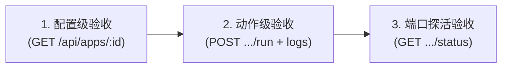

# AI 接入指南与 API 文档

> **文档版本 (Document Version)**: `v2.5.0` (2026-08-24)
> 
> **设计初衷与核心价值：**
> 
> App-Deck 是项目运维与快捷脚本的**唯一定义中心**，人类与 AI 共同使用这一套资产：
> 
> 1. **用户通过 Web 界面统一查看**：用户可以直接在 Web 控制台查看各个项目的快捷功能与运行状态，并享受 JSON 语法树、Markdown 与 Mermaid 架构图的自动渲染；
> 2. **AI 代为执行与跨 Agent 运维**：
>    - 用户可以让 AI 代为执行某个按钮；
>    - **跨 Agent 一键接管**：就算跨不同的 Agent（比如 Claude、Cursor 等），也只要一键复制界面顶部的 AI 接入文档发给 Agent，任何新 Agent 都能立刻通过 API 接管运维工作；
>    - **统一管理，避免脚本散落**：实现跨 Agent 运维，彻底避免不同的 Agent 把脚本随地写在各个地方、难以管理和维护的混乱局面。

## 目录

1. [接入流程](#1-接入流程)
   - [1.1 注册后三维验收闭环与破坏性按钮安全防御矩阵](#11-注册后三维验收闭环与破坏性按钮安全防御矩阵)
2. [基础信息](#2-基础信息)
3. [API 约定](#3-api-约定)
4. [数据模型](#4-数据模型)
   - [4.1 type 选择规则与 pm2 托管 (managed) 铁律](#41-type-选择规则与-pm2-托管-managed-铁律)
   - [4.2 命令静态性与零交互铁律](#42-命令静态性与零交互铁律)
   - [4.3 按钮命令支持的 4 种脚本形态](#43-按钮命令支持的-4-种脚本形态)
5. [接口清单](#5-接口清单)
   - [5.1 项目 CRUD](#51-项目-crud)
   - [5.2 按钮 CRUD](#52-按钮-crud)
   - [5.3 执行、流式与执行记录](#53-执行流式与执行记录)
   - [5.4 系统配置与守护管理](#54-系统配置与守护管理)
6. [AI 工作流示例](#6-ai-工作流示例)
   - [6.1 登记一个新项目（幂等 PUT）](#61-登记一个新项目幂等-put)
   - [6.2 追加指定输出格式的维护按钮（JSON 与 Markdown 示例）](#62-追加指定输出格式的维护按钮json-与-markdown-示例)
   - [6.3 执行按钮](#63-执行按钮)
   - [6.4 查看执行结果](#64-查看执行结果)
   - [6.5 跨 Agent 运维接管标准 4 步流 (Agent SOP)](#65-跨-agent-运维接管标准-4-步流-agent-sop)
7. [幂等与并发](#7-幂等与并发)
8. [最佳实践](#8-最佳实践)
9. [按钮输出多模态格式化规范](#9-按钮输出多模态格式化规范)

---

## 1. 接入流程

AI 接入 App-Deck 的标准执行流程（**强制遵循计划先行与人机确认**）：

1. **读取项目说明**：分析目标项目的使用文档（启动方式、依赖环境、端口、工作目录与常用命令）；
2. **输出计划表（展示给用户并等待确认）**：
   - **禁止未经确认直接调用 API 静默写入**；
   - AI 必须先整理一份清晰直白的 Markdown 计划表呈现给用户，清晰说明要登记什么项目、注入哪些按钮；
   - **若包含高危/破坏性按钮，必须在计划表中显式打上 `⚠️ [高危/破坏性]` 标签**；
   - **标准计划表示例**：

     #### 拟登记项目：个人博客 (blog)
     - **项目基本信息**：目录 `/path/to/blog` | 服务端口 `3000` | 访问地址 `http://localhost:3000` | 备注 `Next.js 博客系统`
     - **拟注入按钮清单**：

       | 按钮名称 | 按钮标识 | 执行类型 | 输出格式 (text/json/markdown) | 执行命令 | 用途说明 |
       |---|---|---|---|---|---|
       | 启动服务 | `start` | 常驻守护 | text | `npm run dev` | 拉起开发服务，支持崩溃自愈 |
       | 运行测试 | `test` | 单次执行 | text | `npm test` | 执行全套自动化测试 |
       | 接口探活 | `health` | 单次执行 | json | `curl -s http://localhost:3000/api/health` | 自动以可折叠 JSON 树展示 |
       | 架构拓扑 | `arch` | 单次执行 | markdown | `cat docs/architecture.md` | 自动渲染 Markdown 与 Mermaid 图 |
       | ⚠️ 清空缓存 | `clean` | 单次执行 | text | `rm -rf .next/cache` | ⚠️ [破坏性] 清除本地构建缓存 |

3. **用户同意后调用 API 注册**：在用户明确确认后，AI 再发起 `PUT /api/apps/:appId`（或 `PUT .../buttons/:buttonId`）幂等写入配置；
4. **注册后三维闭环测试验收（自动化与安全隔离）**：
   - **配置验证**：`GET /api/apps/:appId` 确认配置生效；
   - **常规动作真实验收**：对非破坏性按钮触发 `POST .../run`，通过 `GET .../logs` 校验 `exitCode === 0`；
   - **端口探活验收**：针对 Web 常驻服务，调用 `GET /api/apps/:appId/status` 校验 `{ "online": true }`；
   - **破坏性按钮安全隔离**：对标记为 `⚠️ [破坏性]` 的高危按钮**严禁自动试跑**，仅做静态语法/Dry-run 校验，执行权留给人类在 UI 手动触发；
5. **后续持续维护**：后续有新脚本或参数调整时，同样先出简明表格确认再覆盖写入。

### 1.1 注册后三维验收闭环与破坏性按钮安全防御矩阵

#### 1.1.1 三维闭环验收 SOP (Three-Dimension Verification)
AI 在注册完成后，必须按顺序执行三维验收闭环：



1. **第 1 维：静态配置一致性验收**
   - 调用 `GET /api/apps/:appId`，确认返回的 buttons 清单、工作目录 `dir`、端口 `port` 与预期的 Markdown 计划表 100% 一致。
2. **第 2 维：安全动作真实验收（试跑与断言）**
   - 针对非破坏性按钮（如 `test`、`build`、`health` 探活）发起 `POST /api/apps/:appId/buttons/:buttonId/run`；
   - 紧接着拉取 `GET /api/apps/:appId/buttons/:buttonId/logs`，断言 `exitCode === 0` 且 `success === true`，确保无路径错漏或依赖缺失。
3. **第 3 维：服务端口探活验收**
   - 针对 Web 常驻服务，发起启动后调用 `GET /api/apps/:appId/status`；
   - 断言返回 `{ "online": true }`，确保 TCP 端口已被真正监听，卡片翡翠绿呼吸灯正常亮起。

#### 1.1.2 破坏性按钮四级安全防御矩阵 (Destructive Action Safety Matrix)

| 风险类别 | 典型命令 | 潜在破坏后果 | AI 防御与验收策略 |
|---|---|---|---|
| **1. 数据销毁与清空** | `drop database`、`prisma migrate reset`、`rm -rf data/*`、`flushall` | 数据丢失且不可逆 | **严禁自动试跑**。仅做 `test -d` 路径存在性检查或 `--dry-run` 模拟演练。 |
| **2. 生产发布与覆盖** | `npm publish`、`git push --force`、`./deploy-prod.sh` | 影响线上生产环境 | **严禁自动试跑**。仅做 `npm pack --dry-run` 或语法预检。 |
| **3. 硬件关机与硬杀** | `shutdown /s`、`reboot`、`kill -9` | 设备失联、任务中断 | **严禁自动试跑**。仅做 SSH 免密连通性检查。 |
| **4. 资源消耗与扣费** | 批量调用高计费 API、无上限并发爬虫 | 产生资金或额度浪费 | **严禁自动试跑**。仅做单次轻量 ping 探测。 |

> 🛡️ **破坏性按钮 4 级防御执行铁律**：
> 1. **计划表显式标红**：在向用户展示计划表时，必须打上 `⚠️ [高危/破坏性]` 明确警示；
> 2. **零副作用静态预检**：只允许使用 `bash -n script.sh`（语法校验）或 `python -m py_compile`，绝不触发实际执行；
> 3. **自动化验收绝对熔断**：AI 在执行动作级试跑时，**必须主动跳过所有高危/破坏性按钮**；
> 4. **执行权完全移交人类**：在最终交付报告中明确告知人类：“已完成静态预检，因该操作具有破坏性，未进行自动试跑，留待您在 Web 界面手动点击。”

---

## 2. 基础信息

| 项目 | 值 |
|---|---|
| 服务地址 | `http://localhost:6969` |
| 数据文件 | `~/.app-deck/apps.json`（本地持久化） |
| 认证 | 默认无认证（本地工具，后续版本可配置 Token） |

---

## 3. API 约定

- 全部接口以 JSON 返回，`Content-Type: application/json`
- 成功返回 HTTP `2xx`；失败返回 `4xx/5xx`，错误体为 `{ "error": "描述" }`
- **所有写接口均为幂等**：按 `appId` / `buttonId` 覆盖写入，重复调用不会报错、不会产生重复数据
- 端口固定 `6969`，修改需调整源码常量

---

## 4. 数据模型

### App（项目）

```json
{
  "id": "blog",
  "name": "博客系统",
  "description": "个人博客 web 应用",
  "dir": "/path/to/blog",
  "url": "http://localhost:3000",
  "port": 3000,
  "pinned": false,
  "buttons": []
}
```

| 字段 | 类型 | 必填 | 说明 |
|---|---|---|---|
| `id` | string | ✅ | 唯一标识，URL 安全字符（`a-z0-9-`），不可变 |
| `name` | string | ✅ | 展示名称 |
| `description` | string | ❌ | 备注 |
| `dir` | string | ❌ | 项目目录（按钮命令的相对基准目录） |
| `url` | string | ❌ | 项目访问地址（用于「进入/打开」类按钮） |
| `port` | number | ❌ | 服务端口（用于运行状态探活） |
| `pinned` | boolean | ❌ | 是否置顶（置顶项目排在前面） |
| `buttons` | Button[] | ✅ | 按钮列表 |

### Button（按钮）

```json
{
  "id": "start",
  "label": "启动",
  "type": "managed",
  "command": "npm run dev",
  "cwd": "/path/to/blog",
  "shell": true,
  "outputFormat": "text"
}
```

| 字段 | 类型 | 必填 | 说明 |
|---|---|---|---|
| `id` | string | ✅ | 按钮唯一标识（app 内唯一），不可变 |
| `label` | string | ✅ | 显示名称 |
| `type` | string | ✅ | `managed` = pm2 托管（守护/自启/崩溃重启）；`exec` = 一次性执行 |
| `command` | string | ❌ | 执行的 shell 命令（无动态传参的固定字符串） |
| `cwd` | string | ❌ | 工作目录，缺省继承 `app.dir` |
| `shell` | boolean | ❌ | 是否经 shell 执行（默认 `true`） |
| `outputFormat` | string | ❌ | 输出渲染格式：`text`（默认文本/ANSI）、`json`（JSON 语法树）、`markdown`（Markdown 与 Mermaid 图表） |

### 4.1 type 选择规则与 pm2 托管 (managed) 铁律

| 场景 | type | 按钮设计 | 示例命令 |
|---|---|---|---|
| 常驻 Web 服务 / API / Dev Server（需守护、崩溃自愈、开机自启） | `managed` | **单一启停入口**（运行中按钮自动显示为停止） | `npm run dev`、`.venv/bin/python app.py` |
| 一次性任务：初始化依赖 / 编译构建 / 数据备份 / 探活 / 拓扑 | `exec` | 单次执行脚本，运行后正常退出 | `pip install -r requirements.txt`、`npm run build` |

> ⚠️ **pm2 托管 (`managed`) 三大铁律（必须严格遵守）**：
> 1. **单一入口，严禁冗余按钮**：`managed` 按钮在 Web 界面中内置了双态切换（点击 `▶ 启动` 运行，运行中自动切换为 `⏹ 停止`，底层调用 `pm2 stop`）。**严禁为 `managed` 服务额外创建「关闭服务」、「停止服务」或「重启服务」等冗余按钮**！
> 2. **前台阻塞，严禁 `&`、`nohup` 与手工重定向**：命令必须是**前台运行**（如 `python -m uvicorn ...`）。**严禁在命令末尾添加 `&`、`nohup` 或 `> /tmp/... 2>&1 &`**。如果加了 `&`，主进程将瞬间脱离退出，导致 pm2 误判为 `stopped` 产生假死脱节，而子进程沦为系统孤儿。
> 3. **传统单次脚本才使用独立多按钮**：只有类似 Tomcat（`bin/catalina.sh start` / `stop`）这种本身就是非阻塞单次脚本的工具，才全部使用 `exec` 类型并拆分 start 与 stop。

> 注意：**不要**把一次性命令设为 `managed`（pm2 会把正常退出当作崩溃而反复拉起）。

### 4.2 命令静态性与零交互铁律

1. **固定命令字符串**：App-Deck 按钮命令是点击即刻执行的固定字符串，**不支持运行时 UI 弹窗输入参数**；
2. **严禁动态占位符**：**严禁在命令中写入 `$1`、`$2`、`<parameter>`、`[branch_name]` 等未绑定的占位符**；
3. **零交互式提示 (Non-Interactive)**：命令执行过程中不能要求终端交互输入（如 `read -p`、交互式 `sudo` 密码输入、`npm init` 问答等），需配置 `-y`、`--non-interactive` 或以免密方式执行。

### 4.3 按钮命令支持的 4 种脚本形态

按钮底层直接由操作系统的 Shell 环境执行，AI 可以灵活生成以下多种脚本形态：

1. **直接调用独立脚本文件**：
   - 依赖项目工作目录（`dir` / `cwd`），支持相对路径：
   - `python3 scripts/backup.py`
   - `./deploy.sh`
2. **多命令串联与管道控制 (复合脚本)**：
   - 顺序依赖执行（`&&`）：
     `git pull && npm install && npm run build`
   - 条件分支检测（`||`）：
     `test -d .venv || python3 -m venv .venv`
   - 管道与过滤（`|`）：
     `ps aux | grep node | grep -v grep`
3. **内联解释器脚本 (无需在磁盘创建脚本文件)**：
   - **内联 Python**（通过 `-c` 参数嵌入完整代码）：
     `python3 -c "import time; print('准备备份...'); time.sleep(1); print('完成')"`
   - **内联 Bash**（通过 `-c` 参数嵌入多语句与循环）：
     `bash -c 'for i in 1 2 3 4 5; do echo "进度: $i"; sleep 1; done'`

---

## 5. 接口清单

### 5.1 项目 CRUD

| 方法 | 路径 | 说明 |
|---|---|---|
| GET | `/api/apps` | 列出全部项目 |
| GET | `/api/apps/:appId` | 获取单个项目 |
| PUT | `/api/apps/:appId` | **创建 / 覆盖**项目（幂等 upsert，AI 主用） |
| POST | `/api/apps` | 创建项目（`id` 由服务端生成，UI 用） |
| PATCH | `/api/apps/:appId` | 局部更新（支持修改置顶状态 `{ "pinned": true }`） |
| DELETE | `/api/apps/:appId` | 删除项目（同时停止托管进程） |

### 5.2 按钮 CRUD

| 方法 | 路径 | 说明 |
|---|---|---|
| GET | `/api/apps/:appId/buttons` | 按钮列表 |
| PUT | `/api/apps/:appId/buttons/:buttonId` | **创建 / 覆盖**按钮（幂等 upsert，AI 推荐用） |
| PATCH | `/api/apps/:appId/buttons/:buttonId` | 局部更新按钮 |
| DELETE | `/api/apps/:appId/buttons/:buttonId` | 删除按钮 |

### 5.3 执行、流式与执行记录

| 方法 | 路径 | 说明 |
|---|---|---|
| POST | `/api/apps/:appId/buttons/:buttonId/run` | 执行按钮（managed 交给 pm2；exec 直接运行） |
| POST | `/api/apps/:appId/buttons/:buttonId/cancel` | 停止正在执行的命令（进程树清理） |
| GET | `/api/apps/:appId/buttons/:buttonId/stream` | **SSE 实时流式日志推流**（`data: chunk`，结束推 `event: end`） |
| POST | `/api/apps/:appId/open-terminal` | 一键唤醒宿主系统本地终端并自动进入项目工作目录 |
| GET | `/api/apps/:appId/buttons/:buttonId/status` | 按钮/进程状态 |
| GET | `/api/apps/:appId/buttons/:buttonId/logs` | 按钮执行记录（时间、退出码、输出摘要、成败） |
| DELETE | `/api/apps/:appId/buttons/:buttonId/logs` | **清空指定按钮的所有执行记录** |
| DELETE | `/api/apps/:appId/buttons/:buttonId/logs/:runId` | **删除某条特定的执行记录** |
| GET | `/api/apps/:appId/status` | 项目运行状态探活（TCP 端口探测，无缓存） |
| GET | `/api/apps/:appId/logs` | 项目级执行记录（合并所有按钮历史，带按钮 label） |
| DELETE | `/api/apps/:appId/logs` | **清空项目的所有执行记录** |
| DELETE | `/api/apps/:appId/logs/:runId` | **删除某条特定的执行记录** |

**项目探活响应**：`{ "online": true|false|null }`。有 `port` 时真实 TCP 连接探测；无 port 返回 `null`。

**项目级执行记录响应**：`{ "entries": [ { ...历史条目, "label": "按钮名" } ] }`，按时间倒序（最新在前）。

**run 响应**：`202 { "state": "running", "runId": 1 }`。执行结果不在此响应中，通过 `logs` 接口查询（历史记录持久化，刷新不丢）。

**status 响应**：`{ "state": "idle|running", "startedAt": 时间戳|null, "lastResult": { "exitCode", "success", "killed", "finishedAt" }|null }`

**logs 响应**：历史记录数组（最新 50 条，倒序返回），每条：

```json
{
  "id": "r1",
  "startedAt": 1720000000000,
  "finishedAt": 1720000001000,
  "exitCode": 0,
  "success": true,
  "killed": false,
  "outputFormat": "text",
  "summary": "输出摘要（末尾 200 字）",
  "output": "完整输出（截断 64KB）"
}
```

### 5.4 系统配置与守护管理

| 方法 | 路径 | 说明 |
|---|---|---|
| GET | `/api/health` | 服务健康检查 |
| GET | `/api/agent-guide` | 获取本 AI 接入指南文档（别名 `/api/aiusage`） |
| GET | `/api/export` | 导出全部配置（备份 / 迁移） |
| POST | `/api/import` | 导入配置（覆盖） |
| GET | `/api/system/status` | 守护/自启状态：`{ daemon, startup, pm2Installed }` |
| POST | `/api/system/daemon` | 开关 app-deck 自身守护（body `{ "enabled": true / false }`） |
| POST | `/api/system/startup` | 开关开机自启（body `{ "enabled": true / false }`） |

**守护/自启说明**：

- `POST /api/system/daemon` 开启时：pm2 拉起 app-deck 后，当前进程自动退出（避免端口冲突）；关闭时：先返回响应，稍后停止 pm2 进程
- `POST /api/system/startup` 在 macOS/Linux 上 `pm2 startup` 需要 sudo，接口返回 `{ "enabled": true, "manual": "sudo env PATH=... pm2 startup ..." }`，需人工在终端执行该命令；Windows 走 `pm2-windows-startup`
- pm2 未安装时守护/自启接口返回 503，`pm2Installed` 为 false

---

## 6. AI 工作流示例

### 6.1 登记一个新项目（幂等 PUT）

#### 示例 A：现代 Web 应用（推荐：pm2 常驻守护模式）
常驻服务（如 Next.js、FastAPI、Flask、Vite）使用 `managed` 类型。**仅需 1 个启动按钮**（启动后自动具备停止功能），无需额外添加停止或重启按钮；搭配 `exec` 类型的维护与探活按钮：

```bash
curl -X PUT http://localhost:6969/api/apps/blog   -H 'Content-Type: application/json'   -d '{
    "name": "个人博客",
    "description": "Next.js 博客系统",
    "dir": "/path/to/blog",
    "url": "http://localhost:3000",
    "port": 3000,
    "buttons": [
      { "id": "start",  "label": "启动服务", "type": "managed", "outputFormat": "text", "command": "npm run dev" },
      { "id": "build",  "label": "编译构建", "type": "exec",    "outputFormat": "text", "command": "npm run build" },
      { "id": "health", "label": "接口探测", "type": "exec",    "outputFormat": "json", "command": "curl -s http://localhost:3000/api/health" }
    ]
  }'
```

#### 示例 B：传统多步非阻塞脚本（exec 模式）
针对 Tomcat、自研起停脚本等非阻塞单次命令，全部使用 `exec` 类型并显式拆分起停动作：

```bash
curl -X PUT http://localhost:6969/api/apps/tomcat   -H 'Content-Type: application/json'   -d '{
    "name": "tomcat",
    "description": "Tomcat 服务器",
    "dir": "/path/to/apache-tomcat-9.0.100",
    "url": "http://localhost:8080",
    "port": 8080,
    "buttons": [
      { "id": "start",   "label": "启动",   "type": "exec", "outputFormat": "text", "command": "bin/catalina.sh start" },
      { "id": "stop",    "label": "停止",   "type": "exec", "outputFormat": "text", "command": "bin/catalina.sh stop" },
      { "id": "restart", "label": "重启",   "type": "exec", "outputFormat": "text", "command": "bin/catalina.sh restart" },
      { "id": "logs",    "label": "查看日志", "type": "exec", "outputFormat": "text", "command": "tail -10 logs/catalina.out" }
    ]
  }'
```

> **未安装或未配置占位**：`dir` 和 `command` 可留空先登记占位，点击按钮时返回 `400 { "error": "请先配置项目路径与项目按钮的脚本" }`，在 UI 编辑表单里补全即可。

### 6.2 追加指定输出格式的维护按钮（JSON 与 Markdown 示例）

```bash
# 注册 JSON 语法树解析按钮
curl -X PUT http://localhost:6969/api/apps/tomcat/buttons/api-status   -H 'Content-Type: application/json'   -d '{
    "label": "健康探测 (JSON)",
    "type": "exec",
    "outputFormat": "json",
    "command": "curl -s http://localhost:8080/api/health"
  }'

# 注册 Markdown / Mermaid 架构图生成按钮
curl -X PUT http://localhost:6969/api/apps/tomcat/buttons/arch-diagram   -H 'Content-Type: application/json'   -d '{
    "label": "查看微服务架构",
    "type": "exec",
    "outputFormat": "markdown",
    "command": "echo "# 微服务拓扑

\`\`\`mermaid
flowchart LR
  Gateway --> Auth
  Gateway --> Order
\`\`\`""
  }'
```

### 6.3 执行按钮

```bash
curl -X POST http://localhost:6969/api/apps/tomcat/buttons/start/run
```

### 6.4 查看执行结果

```bash
curl http://localhost:6969/api/apps/tomcat/buttons/start/logs
```

### 6.5 跨 Agent 运维接管标准 4 步流 (Agent SOP)

当任何新的 AI Agent 介入项目时，遵循以下 4 步即可无缝接管运维：

1. **探测发现 (Discovery)**：读取所有已登记项目与按钮
   ```bash
   curl http://localhost:6969/api/apps
   ```
2. **代为执行 (Execute)**：触发指定项目的某个运维动作
   ```bash
   curl -X POST http://localhost:6969/api/apps/tomcat/buttons/start/run
   ```
3. **检查产物 (Inspect)**：获取最新执行状态与多模态日志
   ```bash
   curl http://localhost:6969/api/apps/tomcat/buttons/start/logs
   ```
4. **集中增补 (Upsert)**：发现缺少命令时，通过 API 自动增补新按钮（集中管理，不污染本地目录）
   ```bash
   curl -X PUT http://localhost:6969/api/apps/tomcat/buttons/clean-cache      -H 'Content-Type: application/json'      -d '{"label": "清理缓存", "type": "exec", "outputFormat": "text", "command": "rm -rf work/* temp/*"}'
   ```

---

## 7. 幂等与并发

- **幂等**：`PUT /api/apps/:appId` 与 `PUT .../buttons/:buttonId` 均为覆盖语义。AI 多次补发配置不会产生重复数据
- **并发**：同一按钮的 `run` 请求在**执行期间重复调用将返回 `409`**（防并发点击）。等待执行完成后才可再次触发
- **托管按钮**：已在线时再次 `run` 返回 `409`，避免重复拉起
- **取消**：执行中的命令可 `POST .../cancel` 停止（跨平台进程树清理），历史记录标记 `killed: true`

---

## 8. 最佳实践

1. **严格落实三维闭环验收**：注册完成后依次执行「配置一致性 -> 安全动作试跑 (exitCode === 0) -> TCP端口探活 (online: true)」，确保全部按钮开箱即用
2. **识别一次性 vs 常驻**：把握不定时优先 `exec`，避免 pm2 反复拉起
3. **显式声明 outputFormat**：当脚本产物为结构化 JSON 或含 Mermaid 图表的 Markdown 时，在按钮上显式声明 `"outputFormat": "json"` 或 `"outputFormat": "markdown"`，App-Deck Dock 底部控制台将直接精准渲染，用户无需手动切换
4. **巧用内联解释器脚本**：临时小工具、探测或轻量数据统计无需在磁盘创建独立脚本文件，直接在 `command` 字段中写 `python3 -c "..."` 或 `bash -c "..."`
5. **命令写相对路径**：cwd 单独用 `dir`/`cwd` 字段表达，不要拼在 command 里，便于维护
6. **按钮 id 稳定**：id 是程序标识，label 才是展示文案；后续文案变化只改 label
7. **敏感信息**：API 未带认证，请不要写入密钥；如需，将凭证放入 cwd 目录下的独立配置文件（.env 类）
8. **计划先行与表格化对齐**：为新项目生成按钮时，先输出直白的项目/按钮表格供人类用户审阅，用户同意后再调用 API 注册，保障命令安全性与符合用户预期
9. **严格遵守 pm2 托管铁律**：`managed` 按钮只建 1 个单一入口，命令严禁 `&` 与 `nohup`，切勿额外创建「关闭」或「重启」按钮
10. **坚守破坏性操作安全红线**：严禁自动试跑高危/破坏性按钮，静态预检后在交付报告中明确移交人类在 Web 界面手动触发

---

## 9. 按钮输出多模态格式化规范

App-Deck 控制台内置了多模态渲染器，根据按钮的 `outputFormat` 属性（或内容特征）进行渲染：

| outputFormat | 展现与渲染机制 | 推荐应用场景 | 示例命令 |
|---|---|---|---|
| **`text`** (默认) | 标准 stdout 文本输出。支持 ANSI 彩色控制符与 `INFO`（蓝）、`WARN`（黄）、`ERROR`（红）日志级别高亮 | 普通文本、构建日志、服务输出、系统探测 | `echo -e "[INFO] 服务启动成功"` |
| **`json`** | 自动解析 JSON 并呈现为可交互折叠的语法树，高亮键值与类型（解析异常时平滑降级展示文本） | 接口健康探活、配置读取、统计数据提取 | `curl -s http://localhost:6969/api/health` |
| **`markdown`** | 完整支持 Markdown 语法（标题、表格、加粗、列表）以及嵌入的 ````mermaid` 高清矢量 SVG 流程图/时序图渲染 | 系统分析报告、指标矩阵、环境快照、架构拓扑 | 包含 ````mermaid flowchart LR; A --> B; ```` |
